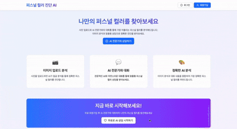
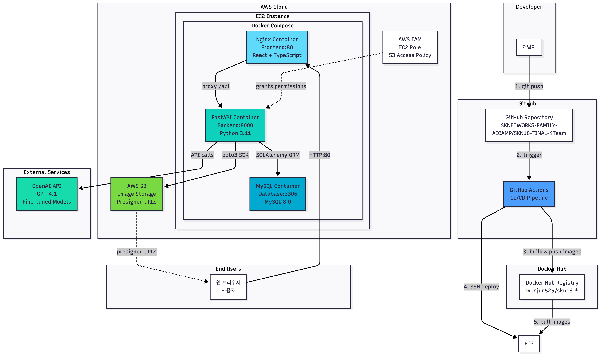

# 🎨 AI 기반 퍼스널컬러 진단 서비스

> **SKN 16기 Final 프로젝트 4팀**  
> AI를 활용한 맞춤형 퍼스널컬러 진단 및 뷰티 추천 서비스


---

## 📋 목차

1. [프로젝트 소개](#-프로젝트-소개)
2. [서비스 데모](#-서비스-데모)
3. [주요 기능](#-주요-기능)
4. [기술 스택](#-기술-스택)
5. [시스템 아키텍처](#-시스템-아키텍처)
6. [설치 및 실행](#-설치-및-실행)
7. [프로젝트 구조](#-프로젝트-구조)
8. [팀원 소개](#-팀원-소개)

---

## 🎯 프로젝트 소개

### 배경 및 목표

현대인들의 외모 관리와 자기표현에 대한 관심이 높아지면서, 퍼스널컬러 진단은 필수적인 뷰티 트렌드로 자리잡았습니다. 하지만 전문가의 오프라인 진단은 시간과 비용이 많이 소요되며, 기존 온라인 서비스는 정확도와 개인화 측면에서 한계가 있었습니다.

**본 프로젝트는 AI 기술을 활용하여 누구나 쉽고 정확하게 자신의 퍼스널컬러를 진단받고, 맞춤형 뷰티 추천을 받을 수 있는 웹 서비스를 제공합니다.**

### 핵심 가치

- **정확성**: 컴퓨터 비전과 머신러닝을 활용한 과학적 분석
- **접근성**: 언제 어디서나 쉽고 편리하게 이용 가능
- **개인화**: AI 챗봇을 통한 맞춤형 뷰티 상담 제공
- **친근함**: 실제 전문가 상담을 받는 것과 같은 편안하고 친절한 경험
- **신뢰성**: 전문가 지식 기반 RAG 시스템으로 정보 제공

### 주요 차별점

1. **이미지 분석 + 대화 분석 통합**: 얼굴 이미지 분석과 사용자 선호도를 결합한 정교한 진단
2. **AI 퍼스널 컨설턴트**: RAG 기반 챗봇으로 24/7 뷰티 상담 가능
3. **데이터 기반 추천**: 사용자별 진단 결과에 따른 맞춤형 제품/스타일 추천
4. **지속적 학습**: 사용자 피드백을 통한 모델 성능 개선

---

## 🎬 서비스 데모

<div align="center">



> 💡 **퍼스널컬러 진단부터 AI 챗봇 상담까지 전체 서비스 플로우를 확인하세요**

</div>

---

## 🌟 주요 기능

### 1. 퍼스널컬러 진단

#### 📸 이미지 기반 분석
- **얼굴 특징 추출**: MediaPipe를 활용한 얼굴 랜드마크 검출
- **피부톤 분석**: Lab 색공간 기반 정밀 피부색 측정
- **4계절 분류**: Spring/Summer/Autumn/Winter 진단
- **세부 시즌**: 12가지 서브 시즌 분류 (예: 봄 브라이트, 여름 뮤트 등)

#### 📝 대화 분석 시스템
- 피부 특성 (밝기, 톤, 민감도)
- 헤어 및 눈동자 색상
- 선호하는 색상과 스타일
- OpenAI GPT-4를 활용한 종합 분석

### 2. AI 뷰티 챗봇

- **RAG (Retrieval-Augmented Generation) 기반**
  - 전문 뷰티 지식 데이터베이스 구축
  - 퍼스널컬러별 추천 메이크업, 헤어 컬러, 패션 스타일 정보
  - 실시간 질의응답 및 맞춤형 상담

- **자연스러운 대화**
  - 감성적이고 공감적인 대화 스타일
  - 사용자 맥락을 고려한 개인화 응답

### 3. 마이페이지

- 진단 결과 히스토리 관리
- 추천 제품/스타일 북마크
- 챗봇 대화 기록 저장
- 재진단 및 결과 비교

### 4. 사용자 관리

- JWT 기반 안전한 인증/인가
- 개인정보 보호 (동의 기반 수집)

---

## 🛠 기술 스택

### **Backend**

| 분류 | 기술 | 설명 |
|------|------|------|
| **Framework** | FastAPI | 고성능 비동기 웹 프레임워크 |
| **Database** | MySQL 8.0 | 관계형 데이터베이스 |
| **ORM** | SQLAlchemy | Python ORM 및 쿼리 빌더 |
| **Migration** | Alembic | 데이터베이스 스키마 버전 관리 |
| **AI/ML** | OpenAI GPT-4 | 자연어 처리 및 응답 생성 |
| **Computer Vision** | MediaPipe, OpenCV | 얼굴 인식 및 이미지 처리 |
| **ML Framework** | scikit-learn | 머신러닝 모델 학습 및 예측 |
| **Authentication** | JWT (python-jose) | 토큰 기반 인증 |

### **Frontend**

| 분류 | 기술 | 설명 |
|------|------|------|
| **Framework** | React 18 | UI 컴포넌트 라이브러리 |
| **Language** | TypeScript | 타입 안전성 보장 |
| **Build Tool** | Vite | 빠른 개발 환경 구축 |
| **UI Library** | Ant Design | 프로페셔널 UI 컴포넌트 |
| **HTTP Client** | Axios | API 통신 |
| **Routing** | React Router | 페이지 라우팅 |

### **AI/ML Pipeline**

| 분류 | 기술 | 설명 |
|------|------|------|
| **Image Processing** | OpenCV, Pillow | 이미지 전처리 및 증강 |
| **Feature Extraction** | MediaPipe | 얼굴 랜드마크 및 특징 추출 |
| **Classification** | Random Forest, XGBoost | 퍼스널컬러 분류 모델 |
| **RAG** | LangChain, FAISS | 벡터 검색 및 문서 검색 |
| **LLM** | OpenAI GPT-4 | 대화형 AI 및 응답 생성 |

### **Deployment & DevOps**

| 분류 | 기술 | 설명 |
|------|------|------|
| **Containerization** | Docker, Docker Compose | 컨테이너화 및 오케스트레이션 |
| **Cloud** | AWS EC2, S3 | 서버 호스팅 및 파일 스토리지 |
| **Web Server** | Nginx | 리버스 프록시 및 정적 파일 서빙 |
| **Version Control** | Git, GitHub | 소스 코드 관리 |

---

## 🏗 시스템 아키텍처


---

## 🚀 설치 및 실행

### 1️⃣ 저장소 클론

```bash
git clone https://github.com/SKNETWORKS-FAMILY-AICAMP/SKN16-FINAL-4Team.git
cd SKN16-FINAL-4Team
```

### 2️⃣ 환경 변수 설정

루트 경로, frontend 폴더에 `.env.example` 파일을 복사하여 `.env` 파일 생성


### 3️⃣ 백엔드 설정 및 실행

```bash
# Python 가상환경 생성 (권장)
python -m venv venv
source venv/bin/activate  # macOS/Linux
# venv\Scripts\activate   # Windows

# 의존성 설치
pip install -r requirements.txt

# 데이터베이스 마이그레이션
alembic upgrade head

# 백엔드 서버 실행
python run.py
```

**백엔드 서버 주소:**
- API: http://127.0.0.1:8000
- API 문서 (Swagger): http://127.0.0.1:8000/docs
- API 문서 (ReDoc): http://127.0.0.1:8000/redoc

### 4️⃣ 프론트엔드 설정 및 실행

새 터미널을 열고:

```bash
cd frontend

# 의존성 설치
npm install

# 개발 서버 실행
npm run dev
```

**프론트엔드 서버 주소:**
- 개발 서버: http://localhost:5173

### 5️⃣ Docker를 사용한 실행 (선택사항)

```bash
# Docker Compose로 전체 스택 실행
docker-compose up -d

# 로그 확인
docker-compose logs -f

# 중지
docker-compose down
```

---

## 📁 프로젝트 구조

```
SKN16-FINAL-4Team/
│
├── 📂 frontend/                    # React 프론트엔드
│   ├── src/
│   │   ├── components/            # 재사용 가능한 컴포넌트
│   │   ├── pages/                 # 페이지 컴포넌트
│   │   ├── services/              # API 서비스
│   │   ├── types/                 # TypeScript 타입 정의
│   │   └── App.tsx                # 메인 앱 컴포넌트
│   ├── package.json
│   └── vite.config.ts
│
├── 📂 routers/                     # FastAPI 라우터
│   ├── user_router.py             # 사용자 인증/관리 API
│   ├── chatbot_router.py          # AI 챗봇 API
│   └── image_router.py            # 이미지 분석 API
│
├── 📂 services/                    # 비즈니스 로직
│   ├── api_color                  # 퍼스널컬러 분석 서비스
│   ├── api_emotion                # 감정 분석 서비스
│   ├── api_image                  # 이미지 분석 서비스
│   ├── api_influencer             # 인플루언서 말투 서비스
│   ├── api_makeup                 # 가상 메이크업 서비스
│   └── orchestrator               # 필요 서비스 체이닝
│
│   └── labeled_data/                # 학습 데이터
│
├── 📂 data/                        # 데이터 파일
│   ├── RAG/                       # RAG 지식 베이스
│   ├── processed/                 # 전처리된 데이터
│   └── chunks/                    # 문서 청크
│
├── 📂 migrations/                  # Alembic 마이그레이션
│   ├── versions/                  # 마이그레이션 파일들
│   └── env.py                     # Alembic 환경 설정
│
├── main.py                         # FastAPI 메인 애플리케이션
├── run.py                          # 서버 실행 스크립트
├── database.py                     # 데이터베이스 연결 설정
├── models.py                       # SQLAlchemy 모델
├── schemas.py                      # Pydantic 스키마
├── requirements.txt                # Python 의존성
├── alembic.ini                     # Alembic 설정
├── docker-compose.yml              # Docker Compose 설정
├── Dockerfile                      # Docker 이미지 설정
└── README.md                       # 프로젝트 문서
```

---

## 👥 팀원 소개

### 팀 구성

|  <br> **한혜경** <br> Main PM / Frontend Lead |   <br> **허원준** <br> Sub PM / Backend Lead |   <br> **진세현** <br> Multimodal AI Engineer |   <br> **임종민** <br> Sub PM / Biz & Comms |
|:------:|:------:|:------:|:------:|
| <a href="https://github.com/Betty310-frontend"></a> | <a href="https://github.com/onejun525"></a> | <a href="https://github.com/chinsehyun"></a> | <a href="https://github.com/jongminlim94"></a> |
| 감정 공감 모델 학습<br/>챗봇 응답 오케스트레이션<br/>\*멀티모달·감정·RAG 모듈<br/>연동 및 체이닝 담당 | 가상 인플루언서 설계<br/>컨테이너 배포 및 운영<br/>\*Docker 기반 백엔드<br/>AWS 배포 담당 | 안면 인식 및 퍼스널 컬러<br/>이미지 분류 시스템<br/>\*LAB 색공간 특징 추출,<br/>4계절·12클래스 분류 모델 구축 | 불변·가변 지식 기반 RAG<br/>\*불변지식: 퍼스널 컬러 등 전문가 지식<br/>\*가변지식: 주기적 갱신되는 트렌드 데이터 |

---

## 🎓 프로젝트 성과

### 기술적 성과

✅ **머신러닝 모델 성능**
- 퍼스널컬러 4계절 분류 정확도: **85%+**
- 서브시즌 분류 정확도: **75%+**
- MediaPipe 기반 실시간 얼굴 특징 추출

✅ **RAG 챗봇 성능**
- OpenAI GPT-4 기반 자연스러운 대화
- FAISS 벡터 검색으로 관련 정보 빠르게 검색
- 평균 응답 시간: **2초 이내**

✅ **시스템 성능**
- FastAPI 비동기 처리로 높은 처리량
- React 최적화로 부드러운 사용자 경험
- Docker 컨테이너화로 쉬운 배포

### 학습 성과

- **협업**: Git/GitHub를 활용한 체계적인 버전 관리 및 코드 리뷰
- **풀스택 개발**: Backend (FastAPI) + Frontend (React) 통합 개발 경험
- **AI/ML 파이프라인**: 데이터 수집 → 전처리 → 모델 학습 → 서비스 배포 전 과정 경험
- **클라우드**: AWS EC2/S3를 활용한 실제 서비스 배포 경험
- **문제 해결**: 실시간 이미지 처리, 대용량 데이터 처리 등 실무 문제 해결

---

## 📚 참고 문서

- [프론트엔드 개발 가이드](./frontend/README.md)
- [RAG 서비스 통합 가이드](./RAG_SERVICE_INTEGRATION_GUIDE.md)
- [EC2 배포 가이드](./EC2_SETUP.md)
- [S3 설정 가이드](./README_S3_EC2_SETUP.md)
- [API 문서](http://127.0.0.1:8000/docs) (서버 실행 후 접속)

---

## 🔧 개발 가이드

### 데이터베이스 마이그레이션

```bash
# 모델 변경 후 마이그레이션 파일 생성
alembic revision --autogenerate -m "변경사항 설명"

# 마이그레이션 적용
alembic upgrade head

# 이전 버전으로 롤백
alembic downgrade -1

# 현재 버전 확인
alembic current

# 마이그레이션 히스토리 확인
alembic history
```

---

## 🐛 문제 해결

### MySQL 연결 오류

```bash
# MySQL 서버 상태 확인
brew services list | grep mysql  # macOS
sudo service mysql status        # Ubuntu

# MySQL 재시작
brew services restart mysql      # macOS
sudo service mysql restart       # Ubuntu
```

### 포트 충돌

```bash
# 포트 사용 프로세스 확인
lsof -i :8000  # 백엔드
lsof -i :5173  # 프론트엔드

# 프로세스 종료
kill -9 <PID>
```
---

## 💕 회고

### 👩‍💻 한혜경 - Main PM / Frontend Lead

이 프로젝트는 기술 리더십, 풀스택 개발, AI 실전 경험을 모두 쌓을 수 있는 소중한 기회였습니다.

**AI Fine-tuning과 감정 인식 모델**
- OpenAI Fine-tuning으로 6가지 감정을 분류하는 모델을 개발하며 프롬프트 엔지니어링의 중요성을 배웠습니다. 많은 시행착오를 거쳐 AI 모델을 실제 서비스에 적용하는 경험을 쌓았습니다.

**Orchestrator 설계와 성능 최적화**
- 팀원들의 다른 스타일 로직을 통합하는 것이 가장 큰 도전이었습니다. 멘토님 조언과 검색을 통해 각 모듈을 독립적으로 호출하는 Orchestrator 패턴을 적용했고, 감정 분석과 지식 검색을 병렬 처리하여 응답 시간을 단축했습니다.

**에러 핸들링과 사용자 경험**
- Fallback 메커니즘으로 API 실패 시에도 서비스가 중단되지 않도록 했습니다. AI 서비스에서는 평가가 매우 중요하다는 것을 깨달았지만, 성능 모니터링 시스템을 충분히 구축하지 못한 점이 아쉽습니다.

이 프로젝트를 통해 기술적 역량뿐 아니라 팀 협업, 문제 해결, 사용자 중심적 사고 등 소프트웨어 엔지니어로서 필요한 역량을 기를 수 있었습니다.

---

### 🔬 진세현 - Multimodal AI Engineer

**이미지 모델링과 퍼스널컬러 분류**

- 퍼스널컬러 분류 파이프라인을 맡아 10종 증강으로 클래스 균형을 맞추고, 눈 위치 기반 ROI와 화이트밸런싱으로 조명·메이크업 노이즈를 줄였습니다. LAB 특징을 재추출해 4계절/11타입 모델을 재학습한 뒤 Gradio 데모로 바로 검증하며 얼굴 검출 실패율과 조명 편향을 낮추어 분류 안정성을 끌어올렸습니다. 데이터 품질(전처리)이 모델 품질을 좌우한다는 점을 체감했고, 다음에는 실사용 로그 기반 피처 분포 모니터링을 붙여 더 견고하게 만들고 싶습니다.

**가상 메이크업**

- Mediapipe+OpenCV 엔진 위에 GPT 파서를 얹어 "립 진하게/블러셔 제거" 같은 자연어 수정 요청을 JSON으로 해석하고 즉시 적용하도록 했습니다. 외부 응답이 비어도 샘플 응답으로 fallback해 데모가 멈추지 않게 만들었고, 퍼스널컬러 기반 추천 색감을 안정적으로 보여줄 수 있었습니다. 이후에는 수정 intent를 실사용 로그로 추가 학습시키고, 적용 속도·품질을 실시간 대시보드로 모니터링하면 더 나은 사용자 경험을 줄 수 있을 것 같습니다.

해당 프로젝트에서 모델링을 맡으며 전처리·특징 설계가 모델 성능을 결정하는 결정적 요소라는 걸 몸소 확인했습니다.

---

### 📊 임종민 - Sub PM / Biz & Comms

가장 보람찼던 순간은 RAG 시스템에서 퍼스널컬러 이론과 패션 트렌드를 통합해 실용적인 조언을 제공했을 때였습니다.

AI API의 한계를 마주했을 때 포기하지 않고 창의적인 해결책을 찾는 과정에서 많이 성장했습니다. 특히 Gemini의 안전 필터 문제를 우회 전략으로 해결한 경험이 값졌습니다.

아쉬운 점은 초기부터 엣지 케이스를 고민하지 못한 것과 문서화를 뒤늦게 시작한 것입니다. "미래의 나를 위한 문서"를 쓰면서 문서화가 생각을 명확히 하는 과정임을 깨달았습니다.

함께 고민하고 해결책을 찾아준 팀원들에게 감사드립니다. "완벽한 시스템은 없지만, 계속 개선하는 시스템은 있다"는 교훈을 얻으며 기술력과 문제 해결 능력을 키울 수 있었습니다.

---

<div align="center">

**Made with ❤️ by SKN 16기 Final 프로젝트 4팀**

</div>
